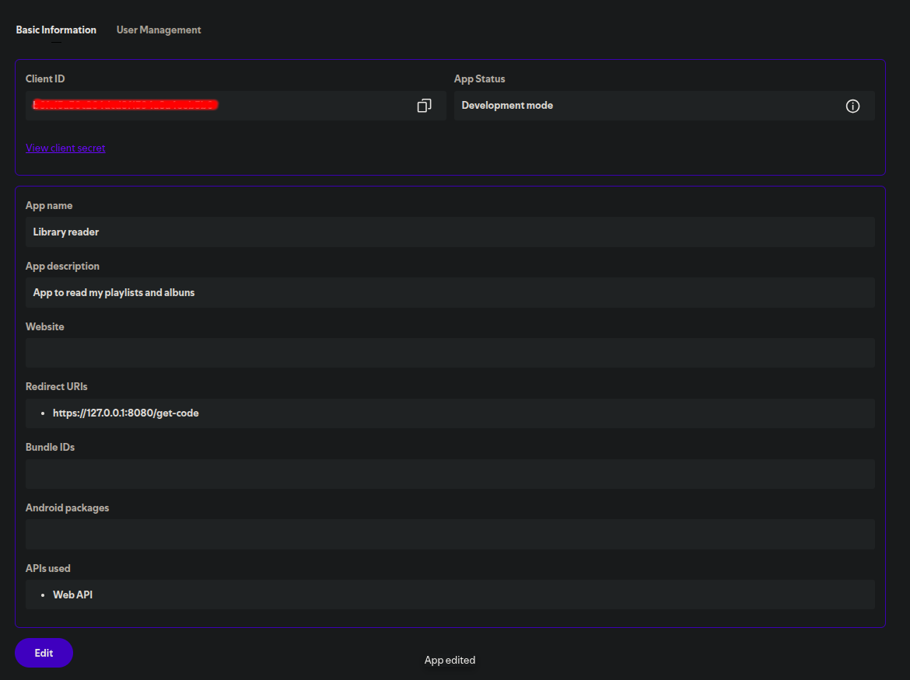

# Spotify Migration

Automation to migrate playlist or albums from Spotify to Youtube

_**Note**: Currently album migration is not supported_

## Environment setting

### Spotify

_**Note**: Currently code retrieval is being done manually_

After register in https://developer.spotify.com/dashboard, you should call the following authorization path to retrieve a authorization code:

```
https://accounts.spotify.com/authorize?client_id=<your_client_id>&response_type=code&redirect_uri=https://open.spotify.com
```



Then add your client id, redirect uri, secret and returned code in a new `.env` file.

Example:

```
SPOTIFY_ID=<id>
SPOTIFY_SECRET=<secret>
REDIRECT_URL=https://open.spotify.com
SPOTIFY_AUTH_CODE=<code>
```

### Youtube

After creating a service account key in https://cloud.google.com/iam/docs/keys-create-delete, you should add it to a new `keyfile.json`, in spotify-migration root directory.


## Run the app

Migrate playlist

``` bash
go run . playlist <your_playlist_name>
```

Migrate album
``` bash
go run . album <album_name>
```

## Contributing

Please don't commit to *master* branch. Thank you.
